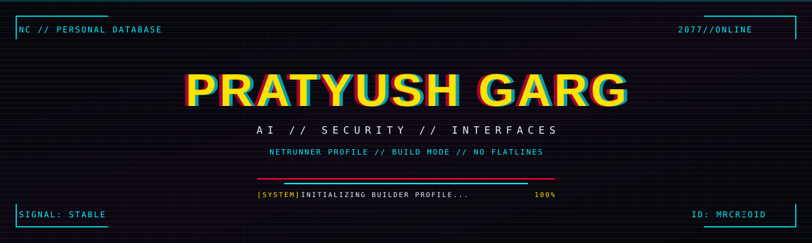
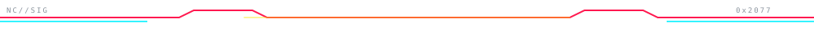
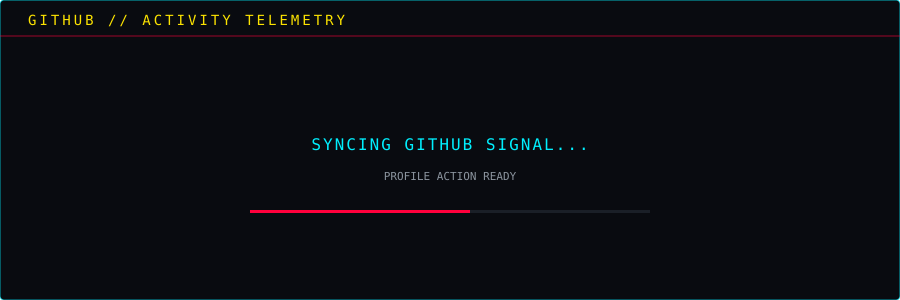
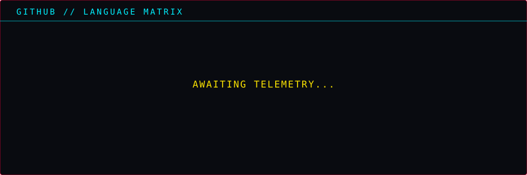
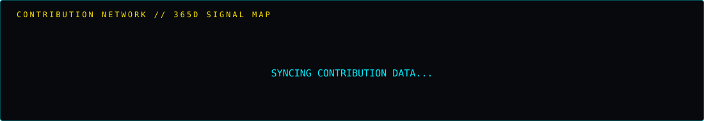

<div align="center">



<br>


<br>

<a href="https://github.com/mrcreoid">

</a>

</div>

---

<div align="center">

### `// NETRUNNER PROFILE`

**PRATYUSH GARG**

`AI` &nbsp;×&nbsp; `SECURITY` &nbsp;×&nbsp; `INTERFACES`

</div>

I build things that I find interesting.

I like taking an idea from **zero → working**, then obsessing over the details until it feels right.

Currently exploring **AI-powered systems, MCP security, frontend experiences, and whatever rabbit hole comes next.**

---

<div align="center">

### `// CURRENT CONTRACT`

```text
╔══════════════════════════════════════════════════╗
║  STATUS       ● ONLINE                           ║
║  MODE         BUILD                              ║
║  THREAT       UNKNOWN                            ║
║                                                  ║
║  AI SYSTEMS        ████████████████░░            ║
║  SECURITY          ██████████████░░░░            ║
║  FRONTEND          ██████████████████            ║
║  EXPERIMENTS       ██████████████████            ║
╚══════════════════════════════════════════════════╝
```

</div>

---

### `// LOADOUT`

<p align="center">

</p>

I don't really have a fixed stack.

I use **different AI tools** to prototype, build, debug, learn, and ship.

The tools change.

**The mission doesn't.**

---

<div align="center">



### `// GITHUB // SIGNAL`




<br><br>



</div>

---

<div align="center">

```text
> CONNECTION ESTABLISHED
> SIGNAL STABLE
> USER IS PROBABLY BUILDING SOMETHING
```

<br>

<a href="https://github.com/mrcreoid">

</a>

<br><br>


<br><br>

### `NO FLATLINES.`

</div>
